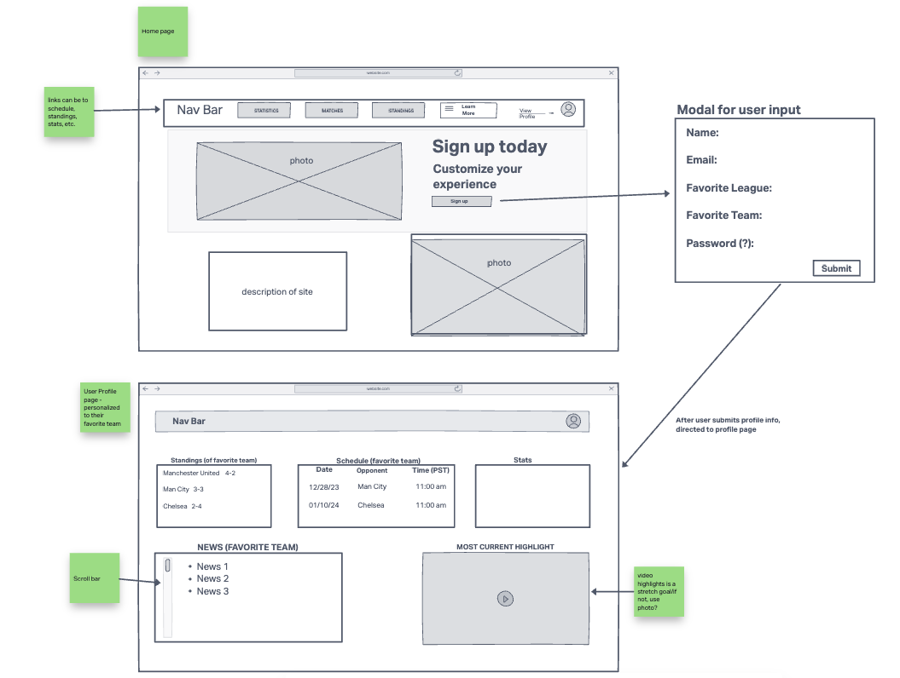
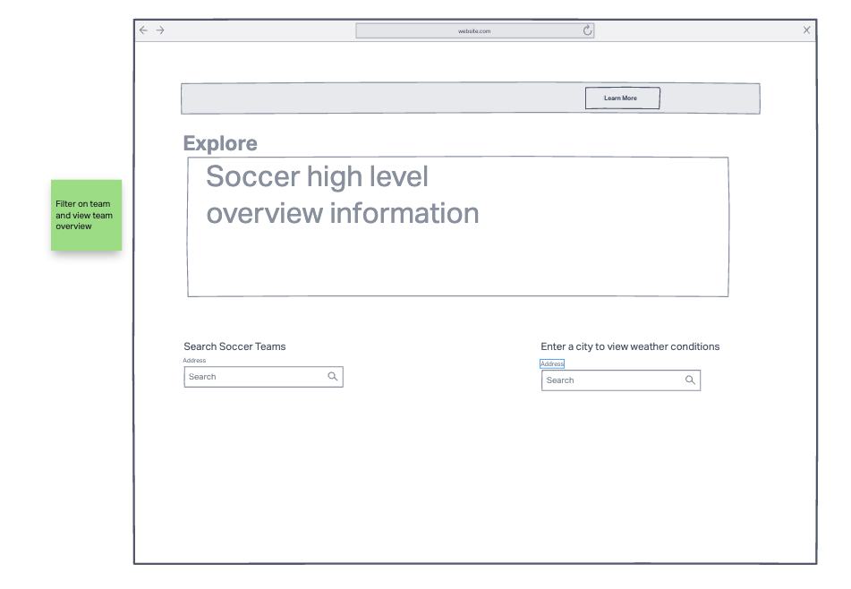
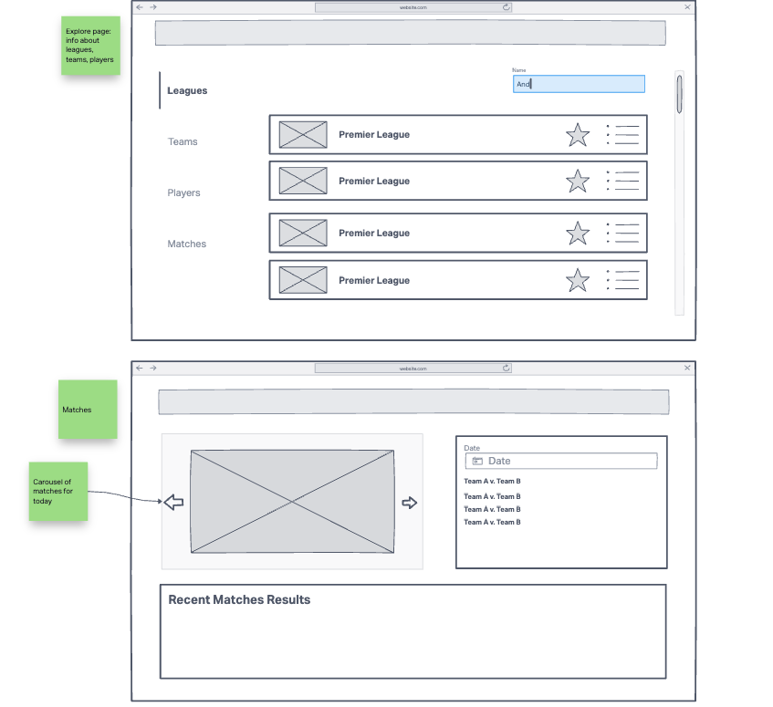
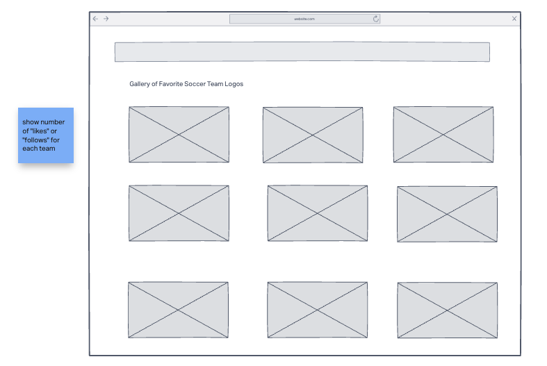
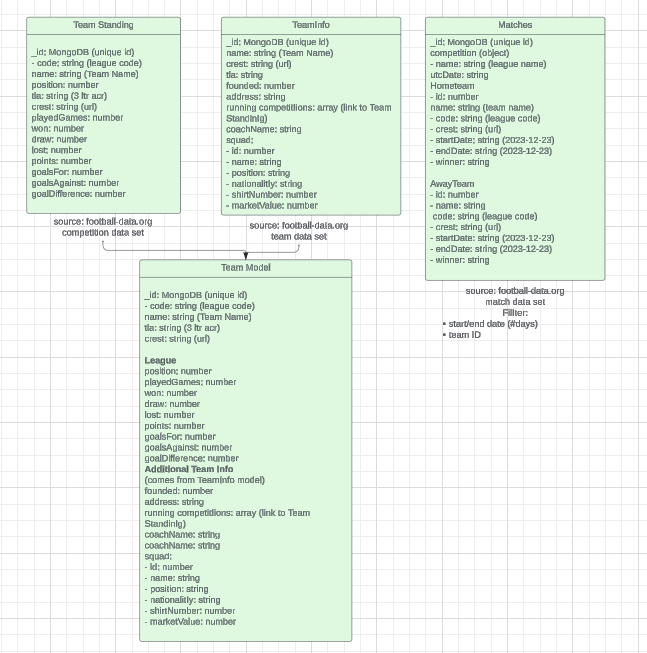

# Futbol Fans

- [Live Deployed Site](https://futbol-fans.netlify.app/)
- [Back-end Repository](https://github.com/RAUC-futbol/futbol-fans-backend)
- [Front-end Repository](https://github.com/RAUC-futbol/futbol-fans-frontend)

## Team Member Names

1. Rhett Chase
2. Caleb Hemphill
3. Ugo Obiako
4. Armando Bugarin

## Description of Project

Fútbol (soccer) fans can build their own dashboards to track their favorite teams. The custom dashboard displays news and statistics for the teams, players and other preferences.

- Users want to track their favorite teams
- Interactive way to customize sports news and statistics

## User Stories

### Filter on my favorite leagues and Teams

As a soccer fan and former player, I want to be able to view stats and news on my favorite teams and leagues.
Feature Tasks: Stats on past matches, view upcoming match schedules, player stats, news, highlights
Acceptance Tests: Filtering works to only show teams/leagues I'm interested in.

### Schedule/Game recaps

As someone who follows sports, I want to stay up to date on the teams schedules and results of previous games.
Feature Tasks: Show up to date schedule for teams, and display match recaps of previous games.
Acceptance Tests: Allow user to search for team schedules and past game results.

### League/Team Information

As a user, I want to learn about the different leagues and their teams.
Feature Tasks: List with description of all soccer leagues, list with descriptions of all the teams in the leagues
Acceptance Tests: The user is displayed a list of all soccer leagues, the user can select a league to view a list of its teams

### Customized User Experience

As a user, I want to customize the application with my preferences.
Feature Tasks: User can create an account to select preferences including a profile photo, color theme, and preference in name of the sport (fútbol, football, soccer)
Acceptance Tests: User is able to create an account, the effects of user's choice of preferences is discernable across the application

### Search and Gallery

As a user, I want to be able to search and view my favorite soccer teams so that I can know more about current league standings.
Feature Tasks: Search and display the soccer team logo based on different criteria such as location, rankings, etc
View statistics about past and upcoming matches, leading teams, goal scorers, etc

Users will be able to search and display the current weather condition for the match location so that they can decide the right clothes to wear based on the weather conditions.

Users will be able to view highlights from other soccer matches around the world.

## Wireframe

## Domain Model

## MVP

- User can log in and create a user profile to customize their experience
  - Form to collect user information and preferences (favorite team, etc.)
  - User selects their preference in name of the sport: football, fútbol, soccer
- When the user is logged in, they can view and edit a dashboard of customizable statistics
  - Use a database to store which teams, players, or other datasets are in the user's dashboard
- Searchable/filterable list of statistics by team
- Information feed of upcoming matches sorted by league and team
- 3rd Party API accessed to create custom database of sports information
- External server to host back-end
- External database to store user information (securely)